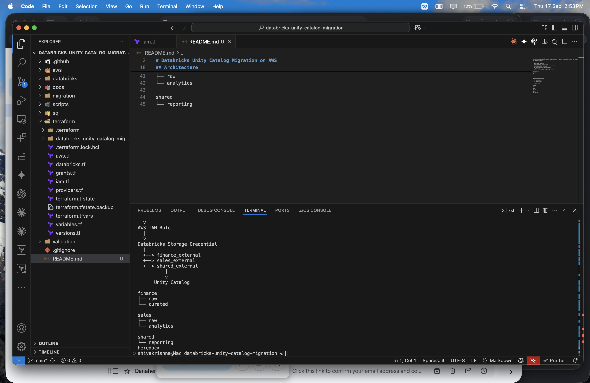
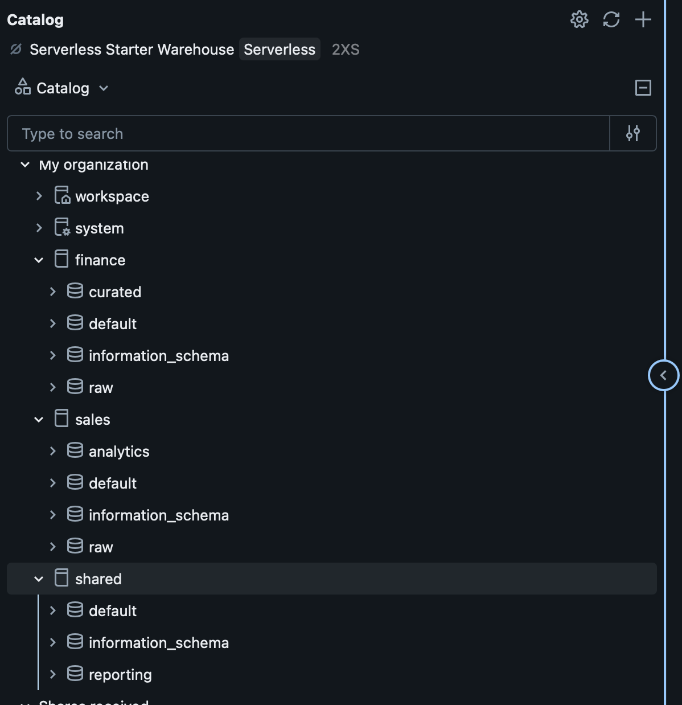
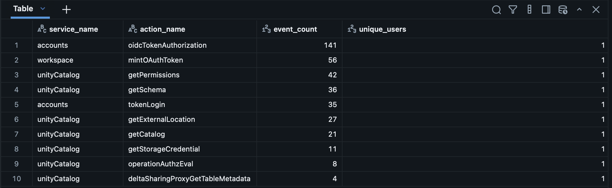
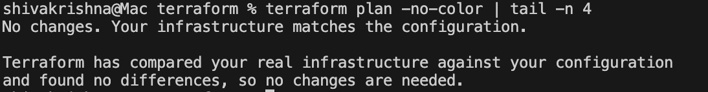

# Databricks Unity Catalog Migration on AWS

Portfolio project demonstrating a governed Databricks platform on AWS using Unity Catalog, Terraform, IAM, S3, Delta Lake, RBAC, and migration validation.

## Current Project Scope

- AWS S3 storage foundation
- AWS IAM integration for Unity Catalog
- Databricks storage credential
- External locations for Finance, Sales, and Shared data
- Unity Catalog catalogs and schemas
- Raw, curated, analytics, and reporting tables
- Group-based RBAC
- Migration validation checks
- Terraform management of AWS and Databricks resources

## Architecture

```text
AWS S3
  |
  v
AWS IAM Role
  |
  v
Databricks Storage Credential
  |
  +--> finance_external
  +--> sales_external
  +--> shared_external
          |
          v
      Unity Catalog

finance
├── raw
└── curated

sales
├── raw
└── analytics

shared
└── reporting


## What This Project Demonstrates

- Unity Catalog governance on AWS
- AWS IAM integration with Databricks
- External locations and storage credentials
- Domain-based catalogs and schemas
- Raw, curated, analytics, and reporting layers
- Group-based RBAC and least-privilege access
- Automated migration validation
- Terraform import and zero-drift infrastructure management

## Validation Results

- Finance: 5/5 PASS
- Sales: 6/6 PASS
- Total: 11/11 PASS

## Technologies

- AWS
- Amazon S3
- AWS IAM
- Databricks
- Unity Catalog
- Delta Lake
- Terraform
- SQL
- Python
- Git and GitHub

## Infrastructure as Code

Existing AWS and Databricks resources were imported into Terraform and reconciled until Terraform reported zero infrastructure drift.

## Completed Platform Capabilities

- GitHub Actions Terraform CI
- Unity Catalog audit logging and monitoring
- 24-hour audit activity reporting view
- Automated migration validation

## Next Steps

- Migration and rollback documentation
- Architecture screenshots and final documentation
## Migration Documentation

- [Migration Plan](docs/migration-plan.md)
- [Rollback Plan](docs/rollback-plan.md)
- [Architecture](docs/architecture.md)

## Project Screenshots

### Terraform CI



### Unity Catalog Structure



### Migration Validation


### Audit Monitoring



### Terraform Zero Drift


